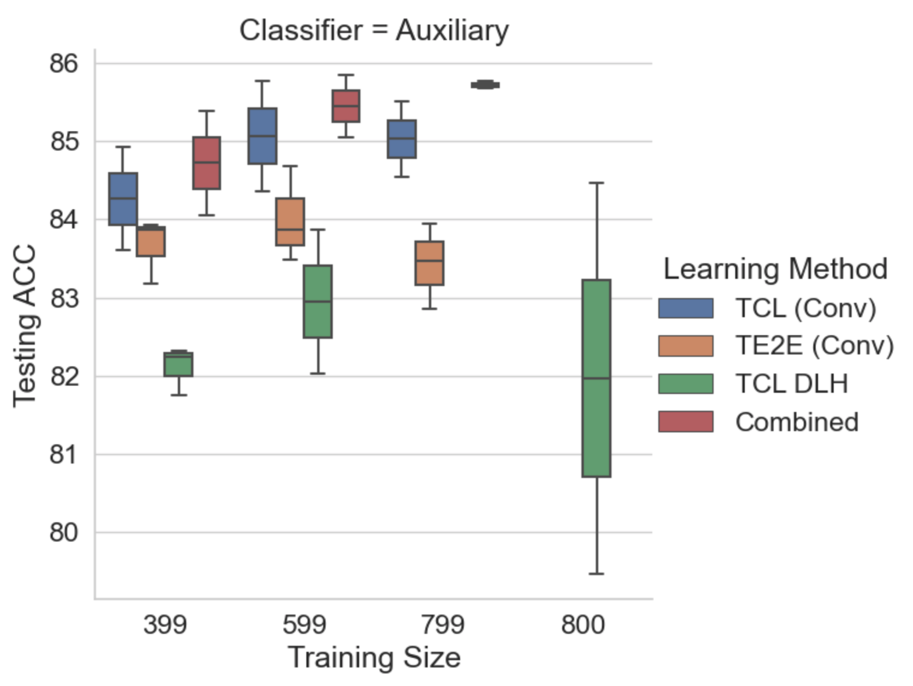

# Project Final Code for CS598 DL4H Spring 2023

## Team Info

This repo is part of group ID 12 final project report, the Paper ID is 79.

The original paper is [Deep Cascade Learning for Optimal Medical Image Feature Representation](https://proceedings.mlr.press/v182/wang22a/wang22a.pdf).

We forked from the [original paper’s repo](https://github.com/FrankWJW/cascade_transfer_learning_medical).

## High level explanation

In our report we aimed to reproduce the results from the original paper, specifically for the Transfer Cascade Learning
(TLC) of the IDC images, and further recreate the Figure 2(b) in the paper.

* Setup your code to run on either locally or on the cloud (ie. AWS) - The code requires the Ray tuning framework to run.
* Download the IDC images, place in the right sub-folder location
* Download the pre-trained cascade learning models, and place in the right sub-folder location
* Training is started by running the TCL_IDC.py script - the way to run this script may vary depending on whether you are running locally or via the Ray framework on the cloud

## Code Setup

Ther are some code dependencies, which will vary dependending on whether you want to run things locally or on cloud infra - for the cloud we chose AWS:
* The code heavily depends on having the ray framework installed, specifically for doing the hyperparameter tuning while training
* If you want to run locally, install requirements from requirements.txt
* If you want to run in a ray cluster, refer to the sub-folder `ray` to run on AWS

## Data setup

Data download instructions:
* Download dataset from [here](https://www.kaggle.com/paultimothymooney/breast-histopathology-images)

Once you have downloaded, place as the sub-folder `Breast_Histopathology_Images/IDC_regular_ps50_idx5`.

## Pretrained models

You will need to download the previously cascade trained models from [here](https://drive.google.com/drive/folders/1yqCOjaommJvcErzz01LiJaQbX8V6wy2b?usp=sharing) and place them under the sub-folder `model/sourcemodel/SourceNetwork`.


## Training

If you are running locally, you should now be able to run the following command from the parent folder:

```bash
% python TCL_IDC.py --root_dir='./Breast Histopathology Images' --network_address=./model/sourcemodel/SourceNetwork
```

If you are running from a Ray cluster, then you would run a command like this (once the ray cluster is up and running):
```
% ray submit ray/config.yaml TCL_IDC.py --root_dir=/cascade_transfer_learning_medical/Breast_Histopathology_Images --network_address=/cascade_transfer_learning_medical/model/sourcemodel/SourceNetwork --ray_address='auto'
```

## Results

Our final results can be found on the [final_results_2023-05-01.csv](final_results_2023-05-01.csv).

The notebook [final_results_2023-05-01.ipynb](final_results_2023-05-01.ipynb) contains the code that we used to process
the results and recreate the image comparing our results to the original paper's.

In the following image, you can see our results as `TCL DLH` (green), in context with the original results from the
original paper.


All of the final experiment files/folders can be found under the prefix `final_results_2023-05-01*`.

## Troubleshooting

### MACOS locally

We ran into some issues trying to run the code locally, here is some MACOS specific additional notes for setup:

* Optional uninstall your python version from pyenv (eg. 3.10.x) (see )
```bash
pyenv uninstall 3.10.x # change x if you have something else
```

* Install xz because it's needed for pandas, and you need this before re-installing the python version:
```bash
brew install xz
```

* Install python version on pyenv:
```bash
pyenv install 3.10
```

* Now you can install pandas:
```bash
pip install pandas
```

### MACOS without GPU

Install some Mac specific requirements if you don't have a GPU, these were torch related:

```bash
pip install "torch>=1.7.0+cpu" "torchvision>=0.8.1+cpu" -f https://download.pytorch.org/whl/torch_stable.html
```

## OTHER NOTES

### NOTEBOOK Setup

In order to be able to run jupyter locally for the notebook we had to do the following setup:

```
% python3.10 -m pip install --upgrade pip
% pip install pandas
% pip install "torch>=1.7.0+cpu" "torchvision>=0.8.1+cpu" -f https://download.pytorch.org/whl/torch_stable.html
% pip install ~/Downloads/
% pip install -U "ray[air]"
% pip install opencv-python
% pip install sklearn
% pip install -U scikit-learn
% brew install xz
% pip install -r requirements.txt
```

### CL Models details

Model 3:
```bash
Sequential(
  (0): Conv2d(3, 256, kernel_size=(3, 3), stride=(1, 1), padding=(3, 3))
  (1): MaxPool2d(kernel_size=2, stride=2, padding=0, dilation=1, ceil_mode=False)
  (2): BatchNorm2d(256, eps=1e-05, momentum=0.1, affine=True, track_running_stats=True)
  (3): Conv2d(256, 256, kernel_size=(3, 3), stride=(1, 1), padding=(3, 3))
  (4): MaxPool2d(kernel_size=2, stride=2, padding=0, dilation=1, ceil_mode=False)
  (5): BatchNorm2d(256, eps=1e-05, momentum=0.1, affine=True, track_running_stats=True)
  (6): Conv2d(256, 256, kernel_size=(3, 3), stride=(1, 1), padding=(3, 3))
  (7): MaxPool2d(kernel_size=2, stride=2, padding=0, dilation=1, ceil_mode=False)
  (8): BatchNorm2d(256, eps=1e-05, momentum=0.1, affine=True, track_running_stats=True)
  (9): non_first_layer_cascade_Net(
    (new_conv1): Conv2d(256, 256, kernel_size=(3, 3), stride=(1, 1), padding=(3, 3))
    (pool): MaxPool2d(kernel_size=2, stride=2, padding=0, dilation=1, ceil_mode=False)
    (conv1_bn): BatchNorm2d(256, eps=1e-05, momentum=0.1, affine=True, track_running_stats=True)
    (conv2): Conv2d(256, 128, kernel_size=(3, 3), stride=(1, 1), padding=(3, 3))
    (pool_aux): MaxPool2d(kernel_size=2, stride=2, padding=0, dilation=1, ceil_mode=False)
    (conv2_bn): BatchNorm2d(128, eps=1e-05, momentum=0.1, affine=True, track_running_stats=True)
    (fc1): Linear(in_features=12800, out_features=256, bias=True)
    (drop): Dropout2d(p=0.0, inplace=False)
    (fc2): Linear(in_features=256, out_features=256, bias=True)
    (fc3): Linear(in_features=256, out_features=23, bias=True)
  )
)
```

Model 4:
```
Sequential(
  (0): Conv2d(3, 256, kernel_size=(3, 3), stride=(1, 1), padding=(3, 3))
  (1): MaxPool2d(kernel_size=2, stride=2, padding=0, dilation=1, ceil_mode=False)
  (2): BatchNorm2d(256, eps=1e-05, momentum=0.1, affine=True, track_running_stats=True)
  (3): Conv2d(256, 256, kernel_size=(3, 3), stride=(1, 1), padding=(3, 3))
  (4): MaxPool2d(kernel_size=2, stride=2, padding=0, dilation=1, ceil_mode=False)
  (5): BatchNorm2d(256, eps=1e-05, momentum=0.1, affine=True, track_running_stats=True)
  (6): Conv2d(256, 256, kernel_size=(3, 3), stride=(1, 1), padding=(3, 3))
  (7): MaxPool2d(kernel_size=2, stride=2, padding=0, dilation=1, ceil_mode=False)
  (8): BatchNorm2d(256, eps=1e-05, momentum=0.1, affine=True, track_running_stats=True)
  (9): Conv2d(256, 256, kernel_size=(3, 3), stride=(1, 1), padding=(3, 3))
  (10): MaxPool2d(kernel_size=2, stride=2, padding=0, dilation=1, ceil_mode=False)
  (11): BatchNorm2d(256, eps=1e-05, momentum=0.1, affine=True, track_running_stats=True)
  (12): non_first_layer_cascade_Net(
    (new_conv1): Conv2d(256, 256, kernel_size=(3, 3), stride=(1, 1), padding=(3, 3))
    (pool): MaxPool2d(kernel_size=2, stride=2, padding=0, dilation=1, ceil_mode=False)
    (conv1_bn): BatchNorm2d(256, eps=1e-05, momentum=0.1, affine=True, track_running_stats=True)
    (conv2): Conv2d(256, 128, kernel_size=(3, 3), stride=(1, 1), padding=(3, 3))
    (pool_aux): MaxPool2d(kernel_size=2, stride=2, padding=0, dilation=1, ceil_mode=False)
    (conv2_bn): BatchNorm2d(128, eps=1e-05, momentum=0.1, affine=True, track_running_stats=True)
    (fc1): Linear(in_features=6272, out_features=256, bias=True)
    (drop): Dropout2d(p=0.0, inplace=False)
    (fc2): Linear(in_features=256, out_features=256, bias=True)
    (fc3): Linear(in_features=256, out_features=23, bias=True)
  )
)
```

Model 5:

```
Sequential(
  (0): Conv2d(3, 256, kernel_size=(3, 3), stride=(1, 1), padding=(3, 3))
  (1): MaxPool2d(kernel_size=2, stride=2, padding=0, dilation=1, ceil_mode=False)
  (2): BatchNorm2d(256, eps=1e-05, momentum=0.1, affine=True, track_running_stats=True)
  (3): Conv2d(256, 256, kernel_size=(3, 3), stride=(1, 1), padding=(3, 3))
  (4): MaxPool2d(kernel_size=2, stride=2, padding=0, dilation=1, ceil_mode=False)
  (5): BatchNorm2d(256, eps=1e-05, momentum=0.1, affine=True, track_running_stats=True)
  (6): Conv2d(256, 256, kernel_size=(3, 3), stride=(1, 1), padding=(3, 3))
  (7): MaxPool2d(kernel_size=2, stride=2, padding=0, dilation=1, ceil_mode=False)
  (8): BatchNorm2d(256, eps=1e-05, momentum=0.1, affine=True, track_running_stats=True)
  (9): Conv2d(256, 256, kernel_size=(3, 3), stride=(1, 1), padding=(3, 3))
  (10): MaxPool2d(kernel_size=2, stride=2, padding=0, dilation=1, ceil_mode=False)
  (11): BatchNorm2d(256, eps=1e-05, momentum=0.1, affine=True, track_running_stats=True)
  (12): Conv2d(256, 256, kernel_size=(3, 3), stride=(1, 1), padding=(3, 3))
  (13): MaxPool2d(kernel_size=2, stride=2, padding=0, dilation=1, ceil_mode=False)
  (14): BatchNorm2d(256, eps=1e-05, momentum=0.1, affine=True, track_running_stats=True)
  (15): non_first_layer_cascade_Net(
    (new_conv1): Conv2d(256, 256, kernel_size=(3, 3), stride=(1, 1), padding=(3, 3))
    (pool): MaxPool2d(kernel_size=2, stride=2, padding=0, dilation=1, ceil_mode=False)
    (conv1_bn): BatchNorm2d(256, eps=1e-05, momentum=0.1, affine=True, track_running_stats=True)
    (conv2): Conv2d(256, 128, kernel_size=(3, 3), stride=(1, 1), padding=(3, 3))
    (pool_aux): MaxPool2d(kernel_size=2, stride=2, padding=0, dilation=1, ceil_mode=False)
    (conv2_bn): BatchNorm2d(128, eps=1e-05, momentum=0.1, affine=True, track_running_stats=True)
    (fc1): Linear(in_features=3200, out_features=256, bias=True)
    (drop): Dropout2d(p=0.0, inplace=False)
    (fc2): Linear(in_features=256, out_features=256, bias=True)
    (fc3): Linear(in_features=256, out_features=23, bias=True)
  )
)
```

# REFERENCES

* https://docs.ray.io/en/latest/cluster/vms/getting-started.html#vm-cluster-quick-start